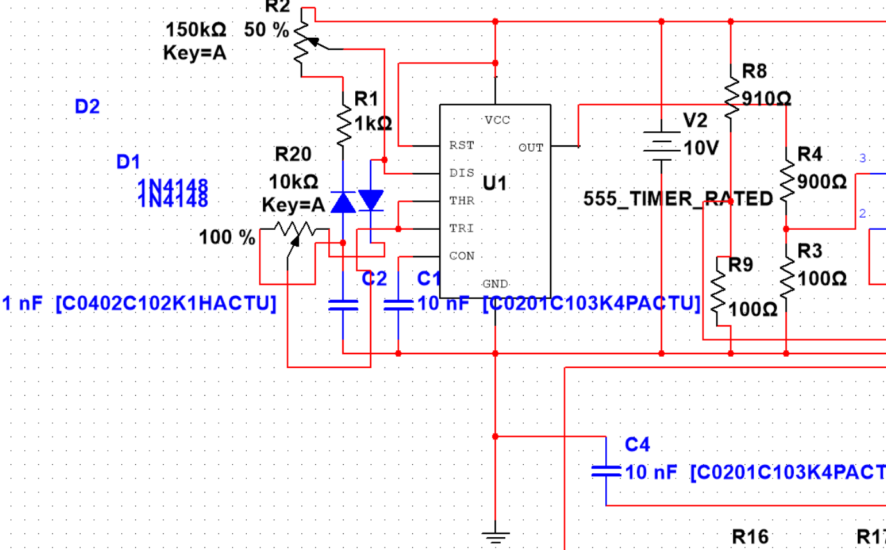
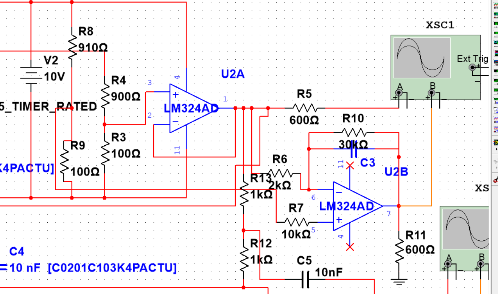
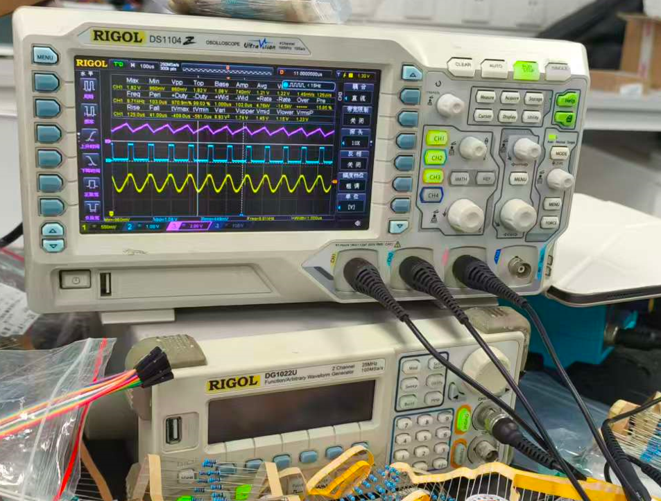

## 前情提要

风和日丽的一天。班里某爱玩原神的周同学联系我说光电学院B311实验室的两名同学想要参加电子设计大赛，但是缺一个人。这个时候周同学想到了我这块十分好搬的砖。我也不知道找我这个愣头青，出于想让电子实验室大佬带我赢的心情，我答应了。缘起就是我大一做过一点点关于电子设计的东西。但并未加入电子实验室。我便想要完成这么一次比赛充实自己。

## 过程中发生的乌龙

我拿到了题目发现事情并不简单。要求用555做一个方波，锯齿波，一次谐波和三次谐波的正弦。选做是：要用运放去做波形的失真。有：顶部失真，底部失真。交越失真。我想了想上学期好像是学过555定时器可以做施密特触发器去完成这些功能。我便加上了那两个队友。线上讨论了一周。

第二周我在南部上课遇到了这俩同学。有个同学的名字比较中性，~~我把他当成了两周的男生()~~

## 开始

从五月份就开始了。我们的进度一直为0。耍了两天我开动了。过程是先设计电路。我先找出了555的引脚和我上学期的笔记，如下

我先找到了让生成标准方波的办法。555无稳态电路的输出高低电平时长由电容充电时间T1和放电时间T2决定：

- 充电：电源VCC经充电电阻给电容C充电，电压从1/3VCC升到2/3VCC，输出高电平；
- 放电：电容C经放电电阻向555的7脚（放电端）放电，电压从2/3VCC降到1/3VCC，输出低电平；
- 占空比：D = T1 / (T1 + T2) × 100%，周期 T = T1 + T2。

**关键设计：二极管隔离的独立充放电回路。** 利用二极管的单向导电性，将充电、放电回路彻底分离，再配合滑动变阻器（电位器）调节两路的电阻值，实现占空比可调：

- 充电回路：Vcc → 充电电阻R1 → 二极管D1 → 电容C → GND
- 放电回路：电容C → 二极管D2正向 → 放电电阻R2 → 555的7脚 → GND

电位器串联在充/放电回路中，调节其滑片即可改变T1或T2，进而调节占空比。

然后我开始画了PCB，我看过很多芯片啊或者电脑主板的布线，有的六层板八层板确实能让人瞋目结舌。我画的智能保证他不断路和短路。至于通不通还得看福分。正直假期末尾。估计嘉立创也不送。估计都大家挺懒得动的。

我便去自己焊接一块试试。来到B311实验室。焊半天果然还是没有通路。

## 过程

等到五一过来之后，基本上全天泡在实验室里头弄。我开始去网上搜集各种方案在那尝试。电工和码农唯一对等的一句话可能：“为什么这个玩意在仿真能跑出来，实际搭出来没东西啊。”。

比如后面的part是做矩形波。我第一个想到的就是积分电路，方波积分形成三角波。我们用的是LM324一个四通道运放。我们其实拿他第一个通道做了一个阻抗转换降低后一级的输入阻抗，不过后期我问学长才知道，在低频的情况下其实做不做阻抗转换意义不大。第二个通道才是积分器。调整RC电路的乘积使得他和输入的方波匹配，能跑出不失真的矩形波（其实是三角板，锯齿波应该不是这么做的，我理解的RC充放电可能叫锯齿波）

……过程非常的艰辛，经常遇到晚上快关门了，搭好的电路波形消失了。快审核的前一天，我们调出了这样的波形

最后我打的板子什么的也是基本没用到，都是拿洞洞板焊的，可见我画板子的能力有多菜了（哭。

最令人难受的是电路最后还是在审核之前烧坏了。最终我们也只获得了方波的分数。虽然以后不知道还不会接触到电路设计的工作，但是我知道了在任何想法面前，稳定性和可用性永远都是第一位的。这和编程是一个道理。

## 最后

最后还是从中学到很多东西。认识了很重要的人的。也是我大学里难忘的经历之一。之后希望我还是会把精力放在我想从事的方向上。
